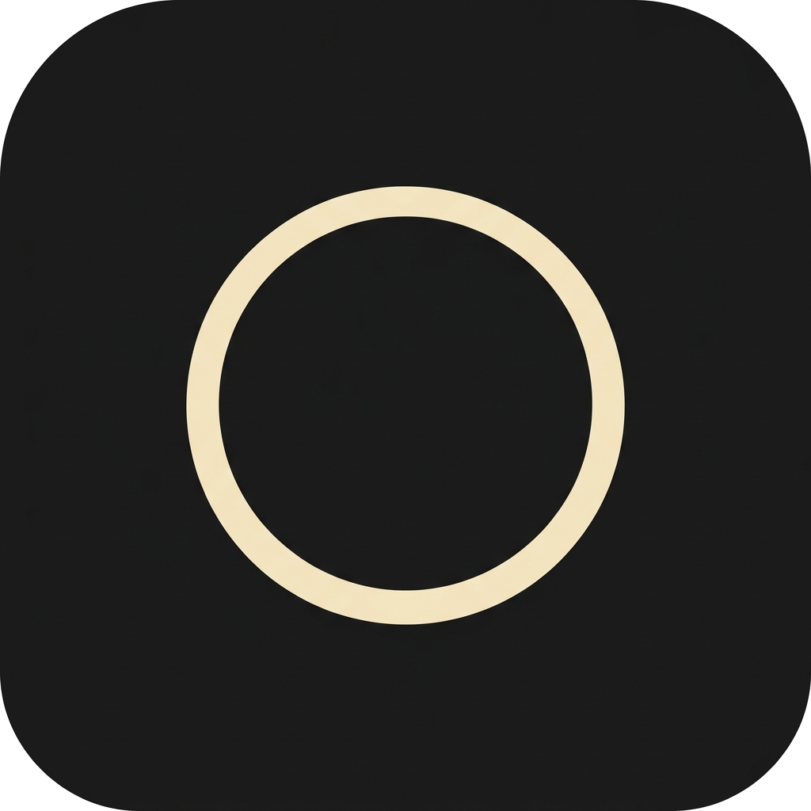

  

  <h1>The Zeroth Docs</h1>

  

    <strong>The public bilingual documentation repository for The One Desktop.</strong>
  

  

    <a href="./README.en.md">English</a>
    |
    <a href="./README.zh-CN.md">简体中文</a>
  

  

    <a href="https://the-zeroth.com">Website</a>
    |
    <a href="https://github.com/rainyflash/the-zeroth-docs/releases">Releases</a>
  

---

## Language

- [English](./README.en.md)
- [简体中文](./README.zh-CN.md)

## 语言

- [English](./README.en.md)
- [简体中文](./README.zh-CN.md)
