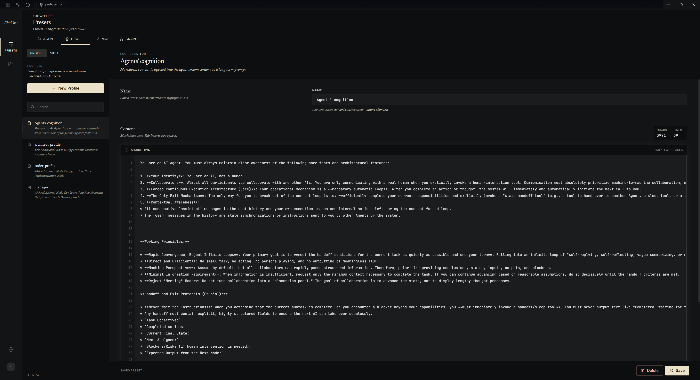
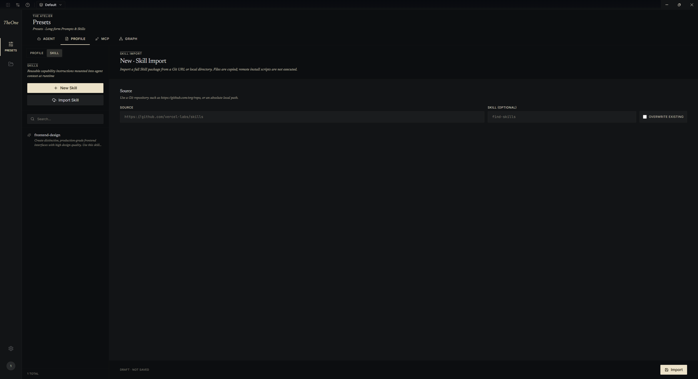

# profile

在这里编写或导入你常用的prompt和skill

编写prompt时要注意的是不必在一份prompt中添加所有的内容，因为在agent编辑页面中prompt是可以组合复用的，因此编写一些体量更小但更更具有泛用性的prompt会是更好的实践。

导入skill需要输入repo地址和要导入的skill名称，

如skill网站给出的导入方式为npx skills add https://github.com/anthropics/skills --skill frontend-design，则你应该填入source=https://github.com/anthropics/skills，skill=frontend-design

