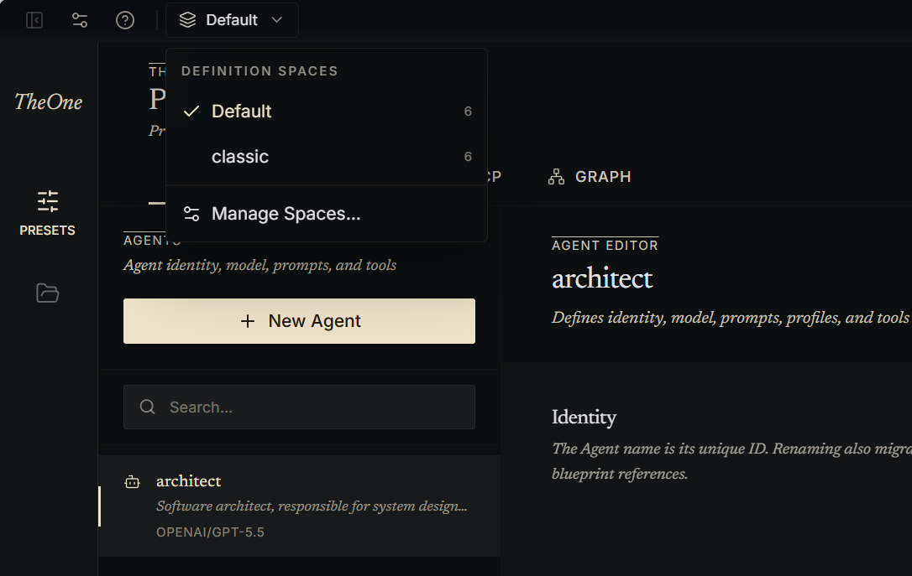
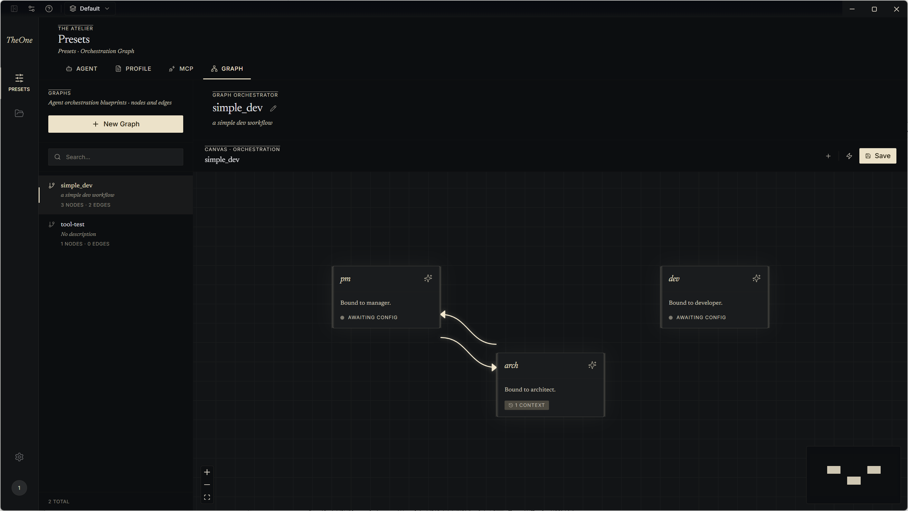
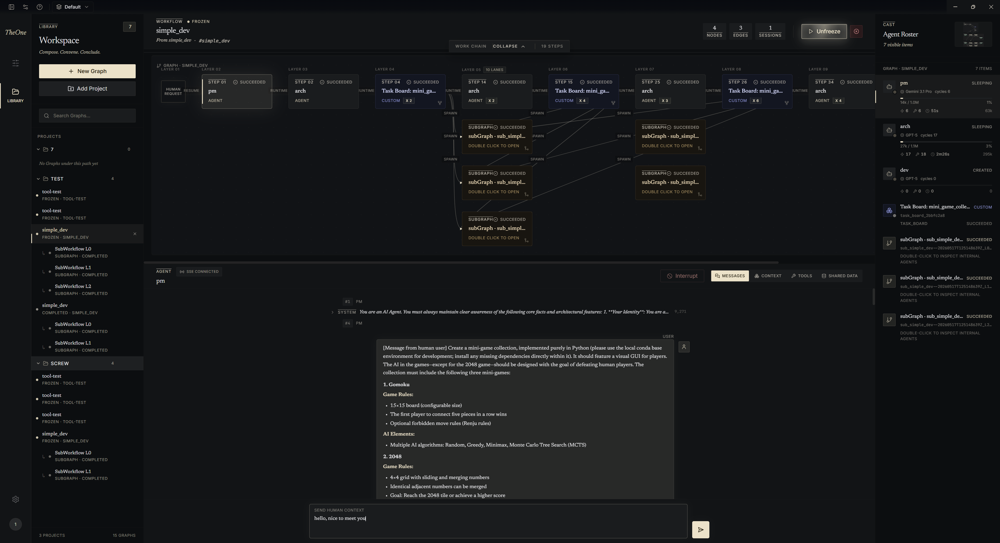

# 快速入门

本指南将带你从安装开始，到在 The One 中运行一个你专属的Multi-Agent。

1.安装The One并登录

链接：下载The One

2.从官方默认的仓储SPACE，或从在分享平台上下载你喜欢的SPACE开始

3.导入你常用的prompt，skill和mcp，用你喜欢的方式来调整agent和graph

4.选择一个graph开始运行，选择其中担任入口角色的agent（如pm）开始对话，就像你在其他ai agent desktop软件中做的那样

